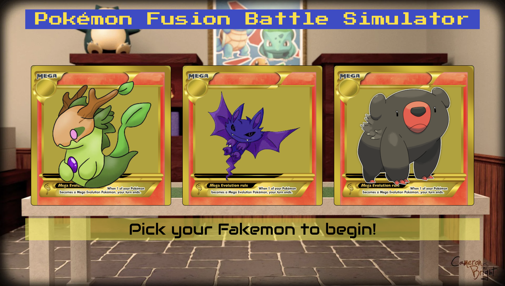
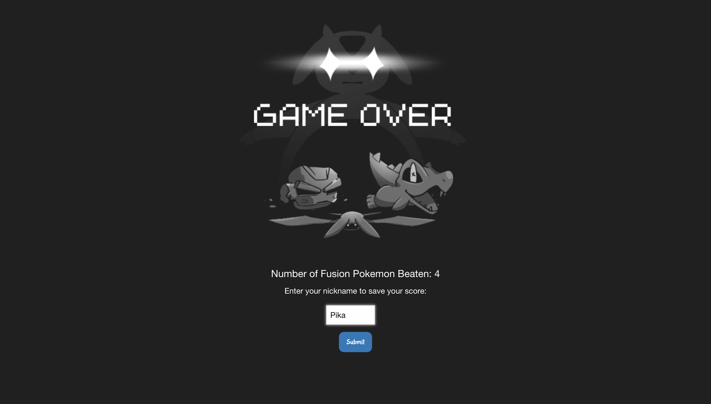

# Pokemon Battle Simulator Game

## Description

This game application was built to allow players to select a fanmade pokemon (also known as fakemon) as their character, set the stats for their character, and go on to defeat as many fusion pokemon as possible to accumulate points.

## Table of Contents

- [Installation](#installation)
- [Usage](#usage)
- [Credits](#credits)
- [License](#license)
- [Website](#website)

## Installation

This game is hosted on GitHub pages and uses user's local storage to store user selection and high scores. There is no installation required.

## Usage

To use this application, the player selects one of the three fakemon to be their character and give it a name. On the next page, the player allocates the given 50 stats to health, attack, speed, and/or defense. On the bottom of this screen, users can see the battle interactions and rules listed out for them. Once ready, they can click the "Start Battle" to face off against a series of fusion pokemon. Whoever has the higher speed stat will get to attack first.

The player can choose between 4 battle actions: normal attack, strong attack, evade, and defend. Each action has its own pros and cons. Normal attacks are guaranteed to hit the enemy but deliver only 75% of the attack power. Strong attacks only have a 70% chance of hitting, but deliver 100% of the attack power. As for evasion, the higher the player's speed stat, the more likely they to succeed in evading the enemy's attack. If they do succeed in evading, they will take 0 damage while also recover their health points based on their speed with a cap of 250 health. With every successful evade, users will have a lower chance to evade on their next evade. Last but not least, the higher the player's defense stat, the more likely they are able to successfully defending themselves and reflecting back that mitaged damage to the opponent. When choosing the defend option, the player will always be able to mitigate at least 5 damage but will also at least take 5 damage.

Each time a battle action is selected, the opposing fusion pokemon will deliver (most of the time) normal attacks and (sometimes) strong attacks back. Before every strong attack, there will be a warning so the player can calculate their moves and choose accordingly. After every battle win, another fusion pokemon with different stats will appear to challenge the player. The more fusion pokemon they beat until they run out of health points, the higher score they will get. When the game is over, the player will be able to save their score by submitting their nickname to the high score board. Once they have viewed the high scores, they can choose to play again or clear scores.

## Credits

Thanks to Instructor Quinton Fults, TA Takara Truong, and TA Black Marcus for helping with the learning on these elements. 

Credits to our group members who worked on this project:

Jason Doss - https://github.com/dossj88
Johnathan Nguyen - https://github.com/jthnguyen9909
Nicole Trieu - https://github.com/nbtrieu
Brian Wang - https://github.com/wangbrian26

## License

N/A

## Website

https://wangbrian26.github.io/Pokemon-Fusion-Battle-Simulator/